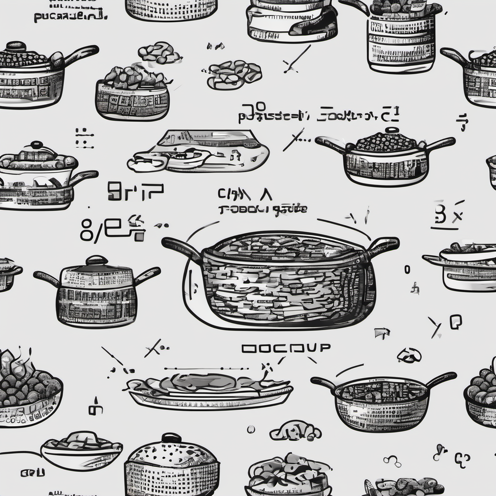

# COtt: cooking language semantics with C++

> In [Ferrara Dialect](https://en.wikipedia.org/wiki/Emilian%E2%80%93Romagnol) *(èsar) cott* means "to be cooked" (e.g., *l'è cott!*), but also "to be knackered/wasted" (e.g., *a't j'è pròpria còtt!*). This acronym 
> is a crasis for *C*, as this is a C++ library, and *[Ott](https://github.com/ott-lang/ott)*, the original tool
> from which I took inspiration for making this library.

Why on Earth would you need to use Rust for writing functional code, when the only thing you need is a proper way 
to better structuring your code? Fear not, as this library is what it needs for having both automatic memory
management à la Java (shared_pointers) with automated recursive view of your rules expressed in lambda notation through
[Yoneda's Lemma](https://en.wikipedia.org/wiki/Yoneda_lemma#Representable_functor).


Some examples given with this library include:

 * Implemeting [natural numbers arithmetics semantics](examples/uint_arithmetics.cpp) while directly evaluating to ```size_t```
 * Implementing [finite CCS small-step semantics](examples/finite_ccs.cpp) while generating the LTS.